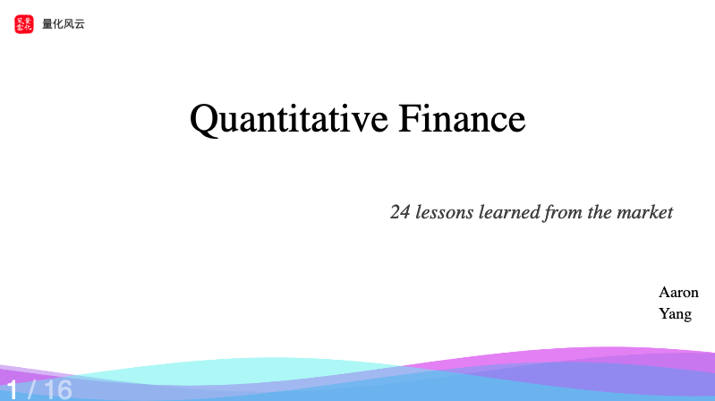
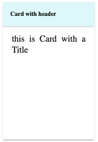
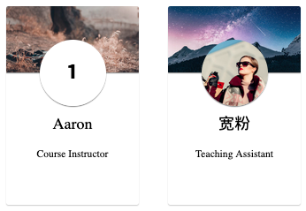

# Slidev-theme-rich

[English](README.md) 
▶️▶️[Live demo](https://zillionare.github.io/slidev-theme-rich/)
[Github](https://github.com/zillionare/slidev-theme-rich)

[](https://www.npmjs.com/package/slidev-theme-rich)

  
Rich是一个Slidev主题，它提供丰富的UI组件和令人惊叹的视觉效果。


关于Slidev，请参考[Slidev](https://github.com/slidevjs/slidev).

[在线演示](https://zillionare.github.io/slidev-theme-rich/)

## 🛠 安装

将以下 frontmatter 添加到您的 `slides.md` 中。启动Slidev然后它会提示你自动安装本主题。

```yaml
    theme: rich
```

对于主题提供的内容，您可以参考 [Demo](https://zillionare.github.io/slidev-theme-rich)以了解有关如何使用主题的更多信息。

## 💼布局

该主题提供以下布局：

###  cover



  
对于其他布局，只需使用内置的 Slidev 即可。

## 🧩 components

**提示：几乎每个组件都支持 v-motion，因此您不必另外声明。**

  
该主题提供以下组件：

###  Device Mockup


  
由 Devices.css 提供支持，支持 10 多种设备，包括 iPhone、Macbook、iMac、Galaxy、Google Pixels、Apple-Watch 等。

####  props

  
这些组件接受以下属性：

| name  | type   | default | description                                         |
| ----- | ------ | ------- | --------------------------------------------------- |
| kind  | String | None    | The name of the device, for example, iphone-14-pro. |
| scale | Number | 1       | to scale the mockup                                 |


  
更多设备名请参考devices.css的文档

####  Styling

  
您可以向组件添加 unocss 指令，即类似 `class="absolute left-50px"` 的指令来调整位置和大小。

```html
    <Device kind="apple-watch-s8"
            class="abs left-50px w-100px"
            style="transform: rotateZ(45deg)"
            scale=0.6
            autoplay
            loop="forever">
    <Video src="*.mp4"/>
    </Device>
```

  
未使用的属性将传递给子元素，在本例中，它是视频，主题提供的另一个组件。

  
您还可以添加特定的样式，就像第 3 行那样。

**请注意，这里我们使用了 `abs` 而不是 `absolute` 。这是一个与后者完全相同的类，但书写起来更简洁**

####  用法示例

```html
    <Device class="abs top-410px left-350px" 
            kind="macbook-pro"
            scale=0.8>
    <Video src="https://cdn.pixabay.com/video/2016/09/21/5373-183629075_medium.mp4"/>
    </Device>
    
    <Device class="abs top-150px left-400px" 
            kind="apple-watch-s8"
            autoplay
            scale=0.6>
    <Video src="https://cdn.pixabay.com/video/2023/07/08/170617-843561820_large.mp4"/>
    </Device>
```

在示例中，我们只是将视频放入设备的屏幕中。但实际上，任何有效的 html/markdown 内容都可以。

### Anime

Animate.css提供了几十种简单但常用的动画。但直接使用它并不方便，比如需要额外引入css文件，样式声明较长、不易记；如果是退出效果，动画在退出动作执行完之后，仍然会回到原始状态等等。

我们提供Anime这个组件，以便可以更容易地使用Animate.css。

#### props

| name   | type                  | default | description                                              |
| ------ | --------------------- | ------- | -------------------------------------------------------- |
| action | String                | ''      | 必须提供，动画名称                                       |
| dur    | String                | 1s      | 动画持续时间                                             |
| delay  | String                | 0ms     | 允许实现延迟加载                                         |
| at     | Number, Array[Number] | -1      | 只在at指定的$clicks时加显示本组件。-1意味着与$clicks无关 |

#### Style
无特殊样式。调用者传入的样式会绑定到组件上。

#### 用法示例

```
<Anime class="abs w-full h-full left-20%">Bounce me</Anime>
```


###  Markmap

  
以交互方式显示演示文稿的议程和目录。


####  props

  
| 名称             | 类型    | 默认 | 描述                               |
| ---------------- | ------- | ---- | ---------------------------------- |
| colorFreezeLevel | number  | 3    | 在哪个级别之后，标记图将冻结颜色图 |
| duration         | 数字    | 200  | 展开/折叠节点时的动画持续时间      |
| maxWidth         | number  | 0    | 标记图的最大宽度                   |
| ExpandLevel      | number  | -1   | 启动时级别会扩展。 -1 表示展开全部 |
| Zoom             | boolean | true | 允许缩放                           |
| pan              | boolean | true | 显示控制面板                       |


#### Styling

  
使用通用 unocss 指令来控制组件的位置和大小。

####  用法示例

```html
    <Markmap class="abs top-400px left-50px w-full">
    
    ` ``
    ## level1
    ### level2
    ## level1
    ` ``
    </Markmap>
```

  
确保将您的内容封装到一对“\`\`\`”（三个backtits）指令中。

### Timeline

Timeline是故事叙述的好帮手。


您通过yaml语法来定义时间轴。其语法是：

```yaml

- event: 1606年
  img: https://*.jpg w=150 roundCorner="50%" shadow="0 2px 5px rgba(0, 0, 0, 0.5)"
  title: 第一张股票
  text: 1606年，荷兰东印度公司发行了人类第一张股票
```

每一项都有event,img, title,subtitle,text来组成。subtitle和text可以省略。

img字段允许添加参数以指定大小、是否圆角和添加阴影。

使用方法：

```md
<Timeline class="abs h-full w-full">

your yaml content here
</Timeline>
```

### SoarText

如果你只有很少几张图，要通过slidev录制一个好的视频，SoarText将是好帮手。它通过把字幕动画化，弥补了视觉元素的不足。

使用方法：

```md
<SoarText class="abs top-150px w-80% h-80%  left-50px" :offsetY=200 colorMix="None">

your subtitles here
</SoarText>
```

SoarText的内容通过markdown来指定：

```md

Nature’s first green is gold<bg>https://images.unsplash.com/photo-1555465910-31f7f20a184d?q=80&w=600

Her hardest hue to hold

Her early leaf’s a flower<bg>https://images.unsplash.com/photo-1478217655296-6ca53ca4b677?w=800

But only so an hour

Then leaf subsides to leaf

So Eden sank to grief

So dawn goes down to day

Nothing gold can stay
```

每一行将在屏幕上作为一个独立的显示部分，当文本较多时，自动缩小字体，反之，自动放大字体。它由文本及背景指标组成。背景可以指定为一张图片。它与显示文本间通过<bg>来分隔。

###  Card

  
一个好的 PowerPoint 演示文稿应尽量使用最少的文本。如果需要文本，则应对其进行有效组织。这就是为什么我们需要 Card 组件。

  
最初的版本提供了三种卡，naive卡、profile卡和Scard卡。



  
正如屏幕截图所示，一张简单的卡片就像一个 CSS 框一样简单。

####  props

| name          | type    | default          | description                                            |
| ------------- | ------- | ---------------- | ------------------------------------------------------ |
| title         | string  | None             | if provided, the card will contains a title            |
| titleAlign    | string  | left             | controls how the title aligned horizontally.           |
| contentAlign  | string  | justify          | controls how the main content aligns.                  |
| gradientTitle | boolean | false            | if true, a gradient background is drawed at title area |
| color         | string  | rgb(223,248,251) | the title's background color                           |
| titleFont     | string  | 20px             | font size of the title                                 |

#### Styling

  
使用通用 unocss 指令来控制组件的位置和大小。

####  用法示例

```html
    <Card title="Card with header"
          :enter="{opacity: 1}"
          :click-1="{opacity: 0}">
    
    this is naive card with a Title. 
    v-motion is supported out-of-box.
    </Card>
    
    <Card :enter="{opacity: 1}"
          :click-1="{opacity: 0}"
          class="abs top-250px left-450px w-300px h-450px">
    
    
    
    this is Card without a Title
    </Card>
```

###  Profile



  
使用此组件来显示人员的个人资料。它需要一个头像img src，如果没有提供，只需使用数字，然后它可以用作带有步骤的列表。

####  props

  
| name      | type   | default | description                      |
| --------- | ------ | ------- | -------------------------------- |
| headerImg | string | None    | 必填，标题背景图片的src          |
| avatar    | string | None    | 头像图片的src                    |
| w         | string | 300px   | 盒子的宽度                       |
| h         | string | 450px   | 高度框                           |
| fontSize  | string | 14px    | 字体大小                         |
| seq       | string | 1       | 序列号。如果头像存在则将被忽略。 |


#### Styling

  
使用通用 unocss 指令来控制组件的位置和大小。

####  用法示例

```html
    <Profile class="top-250px"
    headerImg="https://images.unsplash.com/photo-1517825729380-9df085a3fbc3?w=700&auto=format&fit=crop&q=60&ixlib=rb-4.0.3&ixid=M3wxMjA3fDB8MHxzZWFyY2h8NHx8bW9ybmluZyUyMGNvZmZlZXxlbnwwfDB8MHx8fDA%3D" >
    
    ### Aaron
    
    Course Instructor
    </Profile>
```

###  Scard


  
Card变体的另一个例子。背景和正文被S型曲线分开。

####  props

  
| 名称          | 类型   | 默认  | 描述                                                       |
| ------------- | ------ | ----- | ---------------------------------------------------------- |
| w             | 字符串 | 300px | 卡片的宽度                                                 |
| h             | 字符串 | 450px | 卡片的高度                                                 |
| round         | 字符串 | 10px  | 卡片的半径                                                 |
| contentHeight | 字符串 | 100%  | 卡片的高度内容区域背景                                     |
| background    | 字符串 | ""    | 背景。如果未提供，则将按主题的primary/third 颜色来进行计算 |


#### Styling

  
除了 props 中列出的之外，其他部分可以通过通用 unocss 指令指定。

####  用法示例

```html
    <Scard background="url('https://.../*.jpg') no-repeat center center / cover" 
        h="450px" w="300px"
        class="top-250px left-50px">
       the content of the box
    </Scard>
    
    <Scard background="url('https://.../*.jpg') no-repeat center center / cover" 
        h="450px" 
        w="300px"
        contentHeight="400px"
        class="left-400px top-250px">
       the content of the box
    </Scard>
```


###  Audio

提供带有音量控制、基本淡入、淡出、延迟控制和预定义音频流集合的音频播放。

  
以下屏幕截图显示了内置音频列表：


####  props

 
| name    | type   | default | description                                                                                           |
| ------- | ------ | ------- | ----------------------------------------------------------------------------------------------------- |
| at      | number | -1      | controls when the audio is played. It can be overridden by add `controls` attribute on the component. |
| name    | string | None    | required. The name of predefined audio, or the src url of the audio.                                  |
| fadeOut | number | 0       | fadeOut time in milliseconds                                                                          |
| fadeIn  | number | 0       | fadeIn time in milliseconds                                                                           |
| volume  | number | 1       | the volume of the audio                                                                               |
| delay   | number | 0       | delay time in milliseconds                                                                            |


#### Styling

  
不需要任何样式设计。默认情况下，当 `$slidev.nav.clicks` 等于 `:at` 时，Audio 组件将在后台自动播放，因此没有附加 UI。您可以将 `controls` 添加到其中，如下所示：

```vue
    <Audio name="wechat-huwo" controls />
```

  
这将显示一个播放控制器。

####  用法示例

```html
    <Audio name="wechat-dingdong" controls />
    <Audio name="giggling1" :at=0 :delay=3000 :fadeOut=1000/>
    <Audio name="https://.../*.wav"/>
```

###  Video

  
html 视频标签的简单包装。

####  props

  
name|type|default|description at|number|-1|控制何时显示视频。 -1 表示始终显示，只要页面存在，就始终显示。否则，仅当 `$slidev.nav.clicks` 等于 `at` 时才显示视频。 muted|boolean|false|控制视频是否静音 src|string|None|视频的 src

#### Styling

  
使用通用 unocss 指令来控制视频的位置和大小。

####  用法示例

```html
    <Video src="https://cdn.pixabay.com/video/2016/09/21/5373-183629075_medium.mp4" class="abs top-100px left-100px w-400px h-400px" />
```

## 🔌 插件


###  Admonition


  
Admonition 是另一种卡片，但它是由 markdown-it 插件而不是组件渲染的。

 用法示例：

```markdown
    !!! tip
        this is a tip admonition!
    
    !!! quote
        this is a quote/cite
```

###  emoji图标

  
对于一小部分表情符号图标，您可以在 Markdown 内容中使用以下语法：

```md
    - :smile: using icons is very simple, just write `:smile:`
    - :heart: visit https://emojipedia.org/ for more emoji icons
```

  
正如示例所示，如果您不知道如何引用图标，请查看 https://emojipedia.org，如下截图所示：


**仅 Github 短代码有效**

## 参与开发

*   `npm install`
*     
    `npm run dev` 开始 `example.md` 的主题预览
*     
    编辑 `example.md` 和样式以查看更改
*     
    `npm run export` 生成预览 PDF
*     
    `npm run screenshot` 生成预览 PNG

## History

### 0.2 
- Release at July 4, 2024
- Features:
  - SoarText
  - Timeline
  - Anime
- Fixed:
  - Markmap在初次显示时，可能无法加载，需要刷新一次才能显示。
### 0.1
- Released at June, 2024
- Features:
  - Device Mockup
  - Markmap
  - Card (naive and s-curve split card)
  - Profile
  - Audio
  - Video
  - Markdown admonition
  - Emoji Icon
