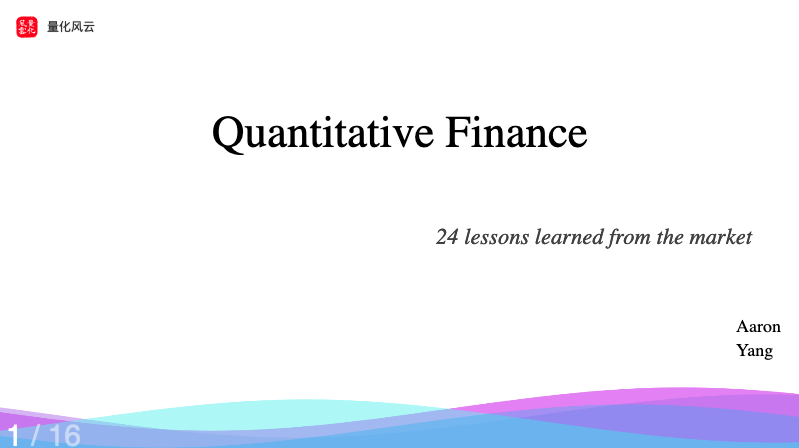
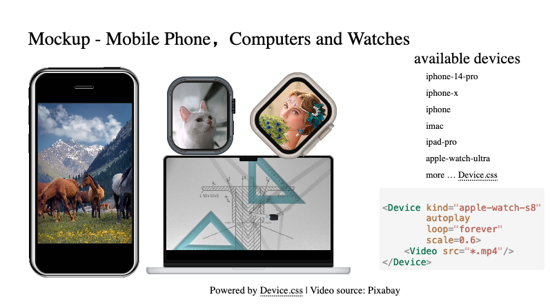
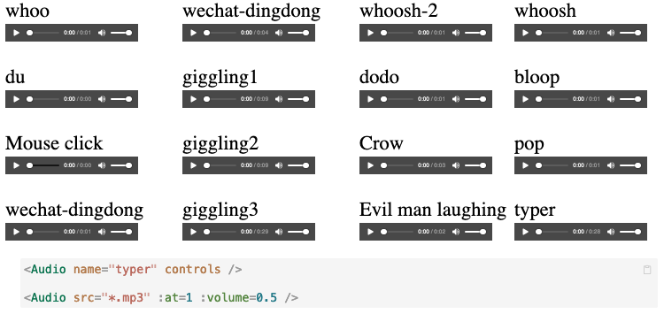
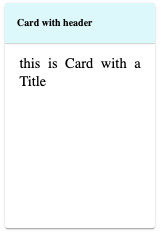
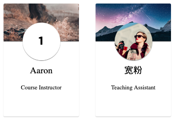
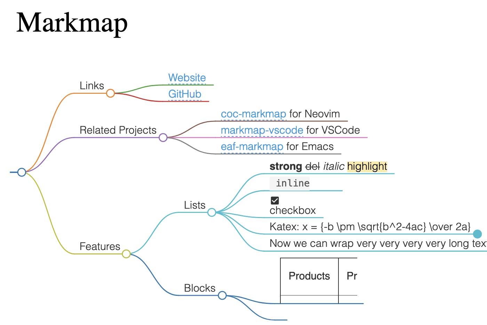
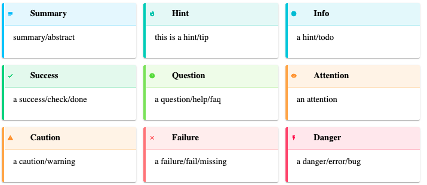
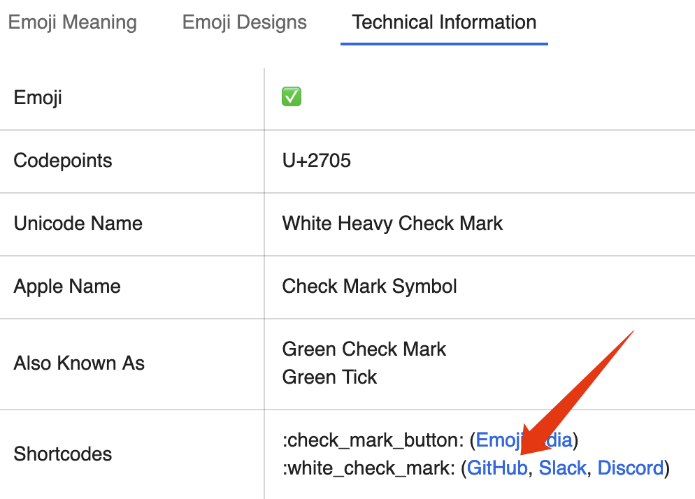

# slidev-theme-rich

[中文文档](https://github.com/zillionare/slidev-theme-rich/blob/main/README-cn.md) 
[Live demo](https://zillionare.github.io/slidev-theme-rich/)
[Github](https://github.com/zillionare/slidev-theme-rich)

[](https://www.npmjs.com/package/slidev-theme-rich)

A Slidev theme that offers rich UI components and stunning visual effects. The following features are available:

* [Device Mockup](#device-mockup)
* [Cards](#card)
  * [Naive Card](#card)
  * [Profile Card](#profile)
  * [S-curve split Card](#scard)
  * [Markdown admonition card](#admonition)
  * [Floating Card]()
* [Markmap](#markmap)
* [Emoji](#markdown-icon)
* [Audio](#audio) with volume control, fadein and out
* [Video](#video) 
* [Animation](#animated-css)


For what is Slidev, please refer to [Slidev](https://github.com/slidevjs/slidev).

<!--
  Learn more about how to write a theme:
  https://sli.dev/themes/write-a-theme.html
--->

<!--
  run `npm run dev` to check out the slides for more details of how to start writing a theme
-->

<!--
  Put some screenshots here to demonstrate your theme

  
-->

[Live demo](https://zillionare.github.io/slidev-theme-rich/)

## 🛠 Install

Add the following frontmatter to your `slides.md`. Start Slidev then it will prompt you to install the theme automatically.

<pre><code>---
theme: <b>rich</b>
---</code></pre>

For what the theme offers, you can refer to the [Demo](https://zillionare.github.io/slidev-theme-rich)

Learn more about [how to use a theme](https://sli.dev/themes/use).

## 💼 Layouts

This theme provides the following layouts:

### Cover



For other layouts, just use slidev built-in.

## 🧩 Components

**Tips: Almost every component support v-motion, so you don't have to declare it additionally.**

This theme provides the following components:

### Device Mockup



Powered by Devices.css, more than 10 kinds of device, including IPhone, Macbook, iMac, Galaxy, Google Pixels, Apple-Watch, and others are available.

#### props

The components accepts the following properties:

| name  | type   | default | description                                         |
| ----- | ------ | ------- | --------------------------------------------------- |
| kind  | String | None    | The name of the device, for example, iphone-14-pro. |
| scale | Number | 1       | to scale the mockup                                 |

For more devices, please refer to the documentation of [devices.css](https://github.com/picturepan2/devices.css)
#### Styling

You can add unocss directive to the component, i.e., something like `class="absolute left-50px"`.

```vue
<Device kind="apple-watch-s8"
        class="abs left-50px w-100px"
        style="transform: rotateZ(45deg)"
        scale=0.6
        autoplay
        loop="forever">
<Video src="*.mp4"/>
</Device>
```

Uncomsumed attributes will pass to child elements, in this case, it's Video, another component provided by the theme.

You can also add specific style, like line 3 does.

**Be noticed here we used `abs` instead of `absolute`. This is a class which is same as the latter.**

#### Example Usage

```md
<Device class="abs top-410px left-350px" 
        kind="macbook-pro"
        scale=0.8>
<Video src="https://cdn.pixabay.com/video/2016/09/21/5373-183629075_medium.mp4"/>
</Device>

<Device class="abs top-150px left-400px" 
        kind="apple-watch-s8"
        autoplay
        scale=0.6>
<Video src="https://cdn.pixabay.com/video/2023/07/08/170617-843561820_large.mp4"/>
</Device>
```

In the example, we just put video in its screen. Any valid html/markdown content will work.

### Audio

Provide audio play with volume control, basic fade-in, fade-out, delay control, and a collection of predefined audio streams.

The following screenshots shows the list of builtin audios:



#### props

| name    | type   | default | description                                                                                           |
| ------- | ------ | ------- | ----------------------------------------------------------------------------------------------------- |
| at      | number | -1      | controls when the audio is played. It can be overridden by add `controls` attribute on the component. |
| name    | string | None    | required. The name of predefined audio, or the src url of the audio.                                  |
| fadeOut | number | 0       | fadeOut time in milliseconds                                                                          |
| fadeIn  | number | 0       | fadeIn time in milliseconds                                                                           |
| volume  | number | 1       | the volume of the audio                                                                               |
| delay   | number | 0       | delay time in milliseconds                                                                            |


#### Styling

No styling is required. By default, the Audio component will play automatically at the background when `$slidev.nav.clicks` equals to `:at`, thus have no UI attached. You can add `controls` to it as the following:

```md
<Audio name="wechat-huwo" controls />
```

This will show a play controller.

#### Example Usage

```md
<Audio name="wechat-dingdong" controls />
<Audio name="giggling1" :at=0 :delay=3000 :fadeOut=1000/>
<Audio name="https://.../*.wav"/>
```

### Video

Simple wrapper of html video tag.

#### props

name|type|default|description
at|number|-1|controls when to show the video. -1 means show always, all the time as long as the page lives. Otherwise, video shows only if `$slidev.nav.clicks` equals to `at`.
muted|boolean|false|controls if the video is muted
src|string|None|the src of the video

#### styling

use generic unocss directive to control the position and size of the video.

#### Example usage

```md
<Video src="https://cdn.pixabay.com/video/2016/09/21/5373-183629075_medium.mp4" class="abs top-100px left-100px w-400px h-400px" />
```

### Anime

Animate.css offers dozens of simple yet commonly used animations. However, direct usage can be inconvenient, requiring additional CSS file imports, lengthy and unwieldy style declarations, and, for exit effects, the animation reverses to its original state after the exit action completes, among other issues.


We provide the Anime component to facilitate easier utilization of Animate.css.

#### props

| name   | type                  | default | description                                                                                                                                   |
| ------ | --------------------- | ------- | --------------------------------------------------------------------------------------------------------------------------------------------- |
| action | String                | ''      | required, the name of animation                                                                                                               |
| dur    | String                | 1s      | duration of the animation                                                                                                                     |  |
| delay  | String                | 0ms     | allow delay load of the animation                                                                                                             |
| at     | Number, Array[Number] | -1      | Display the component only when triggered by the specified $clicks event. A value of -1 indicates that the component is unrelated to $clicks. |

#### Style


No special styling is applied. Styles passed by the caller will be bound to the component.

#### Example Usage

```
<Anime class="abs w-full h-full left-20%">Bounce me</Anime>
```

### Markmap

Interactive display of the agenda and table of contents for the presentation.

It's actually the Vue version of mindmap.

#### Styling

No special styling is applied. Styles passed by the caller will be bound to the component.

You could Use generic unocss directive to control the position and size of the component.

####  Example Usage

```html
    <Markmap class="abs top-400px left-50px w-full">
    
    ` ``
    ## level1
    ### level2
    ## level1
    ` ``
    </Markmap>
```

Ensure that your content is enclosed within a pair of "```" (three backticks) directives.

### Timeline

Timeline is a great tool for storytelling.


You define timelines using YAML syntax. The syntax is as follows:

```yaml

- event: 1606年
  img: https://*.jpg w=150 roundCorner="50%" shadow="0 2px 5px rgba(0, 0, 0, 0.5)"
  title: 第一张股票
  text: 1606年，荷兰东印度公司发行了人类第一张股票
```

Each item consists of event, img, title, subtitle, and text, with subtitle and text being optional.

The img field allows parameters to specify size, whether it's rounded, and to add shadows.

Usage Example:

```md
<Timeline class="abs h-full w-full">

your yaml content here, replace this with a yaml block as below.
</Timeline>
```

```yaml

- event: 1606
  img: https://*.jpg w=150 roundCorner="50%"
  title: The first IPO
  text: In 1606, the Dutch East India Company issued the world's first stock.
```

### SoarText

If you have only a few images and want to create an engaging video using Slidev, SoarText can be a valuable asset. It enhances the visual experience by animating subtitles, compensating for a lack of visual elements.

Usage:

```md
<SoarText class="abs top-150px w-80% h-80%  left-50px" :offsetY=200 colorMix="None">

your subtitles here. Replace it with a markdown block as below showing.
</SoarText>
```

The content for SoarText is specified using markdown:

```md

Nature’s first green is gold<bg>https://images.unsplash.com/photo-1555465910-31f7f20a184d?q=80&w=600

Her hardest hue to hold

Her early leaf’s a flower<bg>https://images.unsplash.com/photo-1478217655296-6ca53ca4b677?w=800

But only so an hour

Then leaf subsides to leaf

So Eden sank to grief

So dawn goes down to day

Nothing gold can stay
```

### Card

A **good** PowerPoint presentation should **strive** to use **minimal** text. 
If text is **necessary**, it should be **organized effectively**. This why we need Card component.

The initial version provides three kinds of cards, the naive one, profile and Scard.



As the screenshot shows, a naive card is as simple as a css box.

#### props

| name          | type    | default          | description                                            |
| ------------- | ------- | ---------------- | ------------------------------------------------------ |
| title         | string  | None             | if provided, the card will contains a title            |
| titleAlign    | string  | left             | controls how the title aligned horizontally.           |
| contentAlign  | string  | justify          | controls how the main content aligns.                  |
| gradientTitle | boolean | false            | if true, a gradient background is drawed at title area |
| color         | string  | rgb(223,248,251) | the title's background color                           |
| titleFont     | string  | 20px             | font size of the title                                 |


#### styling

Use generic unocss directive to control the position and size of the component.

#### Example Usage

```md
<Card title="Card with header"
      :enter="{opacity: 1}"
      :click-1="{opacity: 0}">

this is naive card with a Title. 
v-motion is supported out-of-box.
</Card>

<Card :enter="{opacity: 1}"
      :click-1="{opacity: 0}"
      class="abs top-250px left-450px w-300px h-450px">


this is Card without a Title
</Card>
```

### Profile



Use this component to show people's profile. It requires an avatar img src, if not provided, just use numbers, then it can be used as a list with steps.

#### props

| name      | type   | default | description                                                 |
| --------- | ------ | ------- | ----------------------------------------------------------- |
| headerImg | string | None    | required, src of the header background image                |
| avatar    | string | None    | src of the avatar image                                     |
| w         | string | 300px   | width of the box                                            |
| h         | string | 450px   | height of the box                                           |
| fontSize  | string | 14px    | font size                                                   |
| seq       | string | 1       | the sequence number. Will be ommitted if avatar is present. |


#### styling
Use generic unocss directive to control the position and size of the component.

#### Example Usage

```md
<Profile class="top-250px"
headerImg="https://images.unsplash.com/photo-1517825729380-9df085a3fbc3?w=700&auto=format&fit=crop&q=60&ixlib=rb-4.0.3&ixid=M3wxMjA3fDB8MHxzZWFyY2h8NHx8bW9ybmluZyUyMGNvZmZlZXxlbnwwfDB8MHx8fDA%3D" >

### Aaron

Course Instructor
</Profile>
```

### Scard


Another example of card variants. The background and main text are splitted by a s-cure.

#### props

| name          | type   | default | description                                                                               |
| ------------- | ------ | ------- | ----------------------------------------------------------------------------------------- |
| w             | string | 300px   | the width of the card                                                                     |
| h             | string | 450px   | the height of the card                                                                    |
| round         | string | 10px    | the radius of the card                                                                    |
| contentHeight | string | 100%    | the height of the content area                                                            |
| background    | string |         | the background. If not provided, then it'll be calced by primary/third color of the theme |


#### styling

Except listed in props, the other part can be specified by generic unocss directive.

#### Example Usage

```md
<Scard background="url('https://.../*.jpg') no-repeat center center / cover" 
    h="450px" w="300px"
    class="top-250px left-50px">
   the content of the box
</Scard>

<Scard background="url('https://.../*.jpg') no-repeat center center / cover" 
    h="450px" 
    w="300px"
    contentHeight="400px"
    class="left-400px top-250px">
   the content of the box
</Scard>
```

### Floating Card


It consists of a seq number, a title and a description.

#### Example Usage

```
<FloatingCard :at=[0,1,2,3]
    class="abs w-300px h-500px top-200px left-100px">

```yaml

color: "#F5C345"
capping: header
seq: "01"
title: LOREM IPSUM
desc: Lorem ipsum dolor sit amet, consectetur adipiscing elit, sed do eiusmod tempor incididunt ut labore et dolore magna aliqua. 
```

</FloatingCard>
```

### Markmap

An interactive way to show the agenda, toc of the presentation. 



#### props
| name             | type    | default | description                                                                                                                             |
| ---------------- | ------- | ------- | --------------------------------------------------------------------------------------------------------------------------------------- |
| colorFreezeLevel | number  | 3       | Freeze color at the specified level of branches, i.e. all child branches will use the color of their ancestor node at the freeze level. |
| duration         | number  | 500     | duration of animation when folding/unfolding a node                                                                                     |
| maxWidth         | number  | 0       | maximum width of the markmap                                                                                                            |
| expandLevel      | number  | -1      | the level expands when start. -1 means expand all                                                                                       |
| zoom             | boolean | true    | allow zoom                                                                                                                              |
| pan              | boolean | true    | show control panel                                                                                                                      |


#### styling

use generic unocss directive to control the position and size of the component.

#### Example Usage


```md

<Markmap class="abs top-400px left-50px w-full">

` ``
## level1
### level2
## level1
` ``
</Markmap>
```

Make sure wraps you content into "```" (three backtits) directive.

## 🔌 Plugins

### Admonition



Admonition is another kind of card, but it's rendered by markdown-it plugin, rather than component.

Example usage:

```md

!!! tip
    this is a tip admonition!

!!! quote
    this is a quote/cite
```

### Markdown icon

For a small set emoji icons, you can use the following grammer in markdown content:

```md
- :smile: using icons is very simple, just write `:smile:`
- :heart: visit https://emojipedia.org/ for more emoji icons
```

As the example said, if you don't know how to refer to an icon, check https://emojipedia.org, as the following screenshot shows:



**Only Github shortcodes work**

### Animated css

Animated.css is also integrated in case you'll need some simple CSS animations.

Usage:

```md

<div class="animate__animated animate__bounce abs top-300px w-200px">

:dancer: bounce
</div>
```

The element will automatically bounce the element when the page is loaded.

## Contributing

- `npm install`
- `npm run dev` to start theme preview of `example.md`
- Edit the `example.md` and style to see the changes
- `npm run export` to generate the preview PDF
- `npm run screenshot` to generate the preview PNG

## History

### 0.3
- Released at July 5, 2024
- Features:
  - Floating Card
- Fixed:
  - markmap doesn't work when theme is installed from npmjs
### 0.2 
- Release at July 4, 2024
- Features:
  - SoarText
  - Timeline
  - Anime
- Fixed:
  - Markmap may not load upon the initial display and might require a page refresh to become visible.

### 0.1
- Released at June, 2024
- Features:
  - Device Mockup
  - Markmap
  - Card (naive and s-curve split card)
  - Profile
  - Audio
  - Video
  - Markdown admonition
  - Emoji Icon
